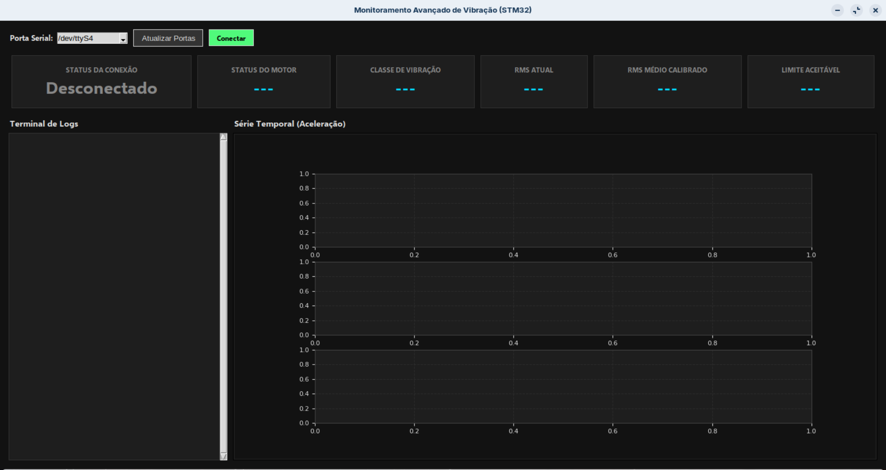
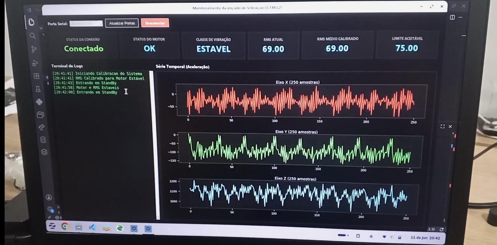
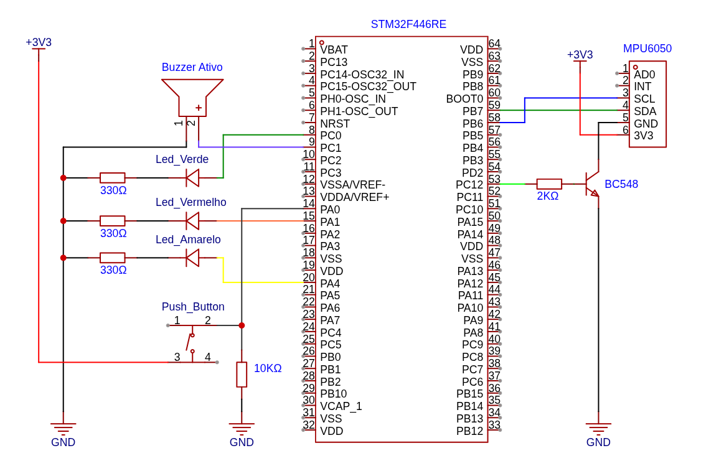

# Sistema Inteligente de Monitoramento de Vibração para Motores Utilizando STM32 e TinyML

## Visão Geral

Este projeto apresenta o desenvolvimento de um sistema embarcado de baixo consumo energético para monitoramento preditivo de motores elétricos por meio da análise de vibração.

A solução foi desenvolvida utilizando um microcontrolador STM32F446RE, um sensor inercial MPU6050, cálculo de RMS e treinamento de um Tiny Machine Learning (TinyML) no Edge Impulse para identificação automática de padrões de funcionamento do equipamento monitorado.

O sistema realiza aquisições periódicas de vibração, calcula indicadores estatísticos de condição e executa inferência local diretamente no microcontrolador, permitindo detectar comportamentos anormais sem necessidade de conexão permanente com servidores externos.

Como requisito principal do projeto, a arquitetura foi concebida para operar utilizando bateria, permanecendo a maior parte do tempo em modo de baixo consumo (Standby) e despertando apenas para realizar medições programadas.

---
---

# Objetivos

## Objetivo Geral

Desenvolver um sistema embarcado autônomo capaz de monitorar a condição operacional de motores através da análise de sinais de vibração, identificando possíveis anomalias e emitindo alertas locais quando necessário.

## Objetivos Específicos

* Adquirir sinais de aceleração em três eixos utilizando o sensor MPU6050.
* Calcular o valor RMS (Root Mean Square) da vibração.
* Implementar uma rotina de calibração inicial automática.
* Armazenar parâmetros de referência em memória não volátil.
* Executar inferência TinyML diretamente no STM32.
* Classificar diferentes condições de operação do motor.
* Emitir alertas visuais e sonoros em caso de anomalia.
* Operar em regime de ultra baixo consumo utilizando modos de economia de energia do microcontrolador.
* Disponibilizar uma interface de usuário para monitoramento em computador via comunicação serial.

---
---

# Arquitetura Geral do Sistema

O sistema é composto por dois módulos principais:

## 1. Módulo Embarcado (STM32)

Responsável por:

* Controle dos periféricos.
* Aquisição dos dados de vibração.
* Processamento dos sinais.
* Cálculo do RMS.
* Execução do modelo TinyML.
* Tomada de decisão.
* Geração de alarmes.
* Gerenciamento de energia.

## 2. Aplicação Desktop

Desenvolvida em Python utilizando:

* Tkinter
* PySerial
* Matplotlib

Responsável por:

* Receber mensagens do STM32 via UART.
* Exibir informações operacionais.
* Exibir histórico de eventos.
* Plotar formas de onda adquiridas.
* Auxiliar na validação e depuração do sistema.

---
---

# Funcionamento do Sistema

## Etapa 1 – Inicialização

Ao ser energizado:

1. O STM32 inicializa seus periféricos.
2. O MPU6050 é alimentado e configurado.
3. É realizada uma verificação de comunicação I²C.
4. Os indicadores luminosos informam o estado do sistema.

---

## Etapa 2 – Calibração Inicial

Na primeira execução:

1. O sistema coleta uma janela de vibração.
2. Calcula o RMS correspondente à condição considerada normal para o motor.
3. Salva esse valor em um registrador de backup do RTC.

Esse valor passa a representar a referência de operação saudável do motor.

---

## Etapa 3 – Aquisição de Dados

Durante cada ciclo de monitoramento:

* Frequência de amostragem: 250 Hz
* Tempo de aquisição: 1 segundo
* Número de amostras: 250 por eixo

São coletadas amostras dos três eixos de aceleração (X, Y, Z) do MPU6050.

Os dados são armazenados em buffers independentes para:

* Cálculo do RMS.
* Inferência TinyML.

---

## Etapa 4 – Processamento

Após a aquisição:

### Cálculo RMS

O RMS representa o nível energético da vibração do equipamento.

Esse indicador é utilizado como métrica rápida para detectar aumento anormal de vibração.

### Inferência TinyML

O modelo embarcado recebe como entrada a aceleração dos três eixos.

A partir dessas informações o modelo classifica a condição operacional do equipamento.

As classes atualmente utilizadas são:

| Classe           |
| ---------------- |
| Estável          |
| Parado           |
| Instável Nível 1 |
| Instável Nível 2 |
| Instável Nível 3 |
| Instável Nível 4 |

---

## Etapa 5 – Tomada de Decisão

A decisão final combina:

### Resultado do RMS

Comparação entre:

* RMS atual
* RMS calibrado
* Margem de tolerância configurada

### Resultado do TinyML

Classificação produzida pelo modelo embarcado.

O sistema somente considera a operação saudável quando ambas as análises concordam.

---

## Etapa 6 – Alarmes

Em caso de comportamento anormal:

### Alerta Sonoro

* Acionamento de buzzer.

### Alerta Visual

* LED Vermelho.

Quando o funcionamento é considerado normal:

* LED Verde.

Eventos de aquisição de dados e processamento:

* LED Amarelo.

---

## Etapa 7 – Economia de Energia

Após finalizar o processamento:

1. O MPU6050 é desligado.
2. O RTC configura o próximo despertar.
3. O STM32 entra em modo Standby.

O sistema permanece em consumo mínimo até o próximo ciclo de monitoramento.

---

## Acionamento Manual por Wake-Up Externo
Além do despertador periódico baseado no RTC, o sistema possui um mecanismo de ativação manual através do pino PA0 (WKUP) do STM32.

Um botão externo conectado a esse pino permite que o operador force a saída do modo Standby a qualquer momento, sem necessidade de aguardar o próximo ciclo programado de monitoramento.

Essa funcionalidade é especialmente útil para:

* Realização de inspeções sob demanda;
* Verificação imediata da condição do equipamento após manutenção;
* Testes de validação em bancada;
* Diagnóstico rápido em campo.

Quando o botão é pressionado:

* O STM32 é despertado do modo Standby;
* Todo o ciclo de aquisição é executado normalmente;
* São realizadas as análises de RMS e TinyML;
* Os alertas são emitidos, caso necessário;
* Ao término do processamento, o sistema retorna automaticamente ao modo de baixo consumo.

---
---

# Comunicação Serial

Todas as informações operacionais são transmitidas em formato JSON.

Exemplo:

```json
{
    "status": "OK",
    "message": "Motor e RMS Estaveis",
    "data": {
        "RMS": 120,
        "RMS_medio": 110,
        "RMS_limite": 121,
        "Classe": "Estavel"
    }
}
```

Também são transmitidos:

* Dados brutos dos sensores.
* Informações de calibração.
* Mensagens de erro.
* Eventos de transição de estado.

---
---

# Interface de Monitoramento

Ao conectar o hardware STM32 com um dispositivo desktop via USB para comunicação serial, a aplicação fornece:

## Painel de Métricas

* Status da conexão.
* Estado do motor.
* Classe identificada.
* RMS atual.
* RMS médio calibrado.
* Limite aceitável.

## Terminal de Logs

Registro cronológico de:

* Inicializações.
* Calibrações.
* Alarmes.
* Erros.
* Mudanças de estado.

## Visualização Gráfica

Exibição das formas de onda:

* Eixo X
* Eixo Y
* Eixo Z

permitindo análise visual dos sinais adquiridos.

## Design da Interface

*Interface antes da conexão ao sistema*


*Interface durante o uso do sistema*

---
---

# Hardware

## Componentes Utilizados

| Componente                | Função                             |
| ------------------------- | ---------------------------------- |
| STM32 F446RE              | Unidade principal de processamento |
| MPU6050                   | Sensor de vibração e aceleração    |
| LEDs                      | Sinalização visual                 |
| Buzzer Ativo              | Alerta sonoro                      |
| Transistor BC548          | Controle da alimentação do sensor  |
| Push Button               | Despertar manual do sistema        |
| Bateria Li-SOCl₂          | Alimentação do sistema             |
| Resistores 330Ω,2KΩ e 10KΩ | Proteção e limitação de corrente   |

---

## Esquemático



---
---

# Consumo Energético

O objetivo desse projeto é garantir autonomia mínima de 10 anos utilizando uma bateria Li-SOCl₂ de 3400 mAh.

Como o sistema funciona em dois modos distintos (Standby e Ativo), é necessário analisar o consumo em cada um deles para estimar a autonomia total.

### -> Consumo em Atividade

Durante o modo Ativo o sistema apresenta consumo ($I_{\text{ativo}}$) de $25\ \text{mA}$.

Seu tempo Ativo é de cerca de 5 segundos, o que significa $\frac{5}{3600}\text{ horas} \approx 0,00139\ \text{h}$ de atividade.

Dessa forma, o consumo médio durante a atividade é:

$$Q_{\text{ativo}} = I_{\text{ativo}} \times t_{\text{ativo}} = 25\ \text{mA} \times 0,00139\ \text{h} = 0,03472\ \text{mAh}$$


### -> Consumo em Standby

Durante o modo Inativo o sistema apresenta consumo ($I_{\text{standby}}$) de aproximadamente $0,03\ \text{mA}$ ($30\ \mu\text{A}$).

Seu tempo Inativo é de 8 horas.

Dessa forma, o consumo médio durante o Standby é:

$$Q_{\text{standby}} = I_{\text{standby}} \times t_{\text{standby}} = 0,03\ \text{mA} \times 8\ \text{h} = 0,24\ \text{mAh}$$

### -> Consumo Total Médio

Considerando os valores acima, o consumo total médio por ciclo de monitoramento (5s de atividade + 8h de standby) é:

$$Q_{\text{ciclo}} = 0,03472\ \text{mAh} + 0,2400\ \text{mAh} = 0,27472\ \text{mAh por ciclo}$$

Como cada ciclo dura praticamente 8 horas, o sistema realiza exatamente 3 ciclos por dia:

$$0,27472\ \text{mAh} \times 3 = 0,82416\ \text{mAh/dia}$$

Dessa forma a autonomia estimada do sistema utilizando a bateria de 3400 mAh é: 
$$\frac{3400}{0,82416} \approx 4.125\ \text{dias} \approx \text{11,3 anos}$$

---
---

# Vídeo Demonstrativo

[](https://youtu.be/T6yau4plxD4?si=yuhKWIRREDmgPA_k)

---
---

# Autores

**Ivysson Fernandes de Queiroz Uchôa**

**Ícaro Emanuel de Queiroz Uchôa**

Projeto desenvolvido para a disciplina de Sistemas Embarcados Bare Metal utilizando STM32 e TinyML.
